# 🎬 Movie Database Explorer 🍿 
##### *Powered by Neo4j*

## Description
A web application for exploring movie and actor relationships using Neo4j graph database. The application allows users to search for actors and movies, visualize their connections, and manage the database through a REST API.

## Features

- Interactive graph visualization of actor-movie relationships
- Actor and movie search with auto-completion
- Detailed actor filmographies and movie cast lists
- Integration with The Movie Database (TMDB) API for actor and movie data

## Installation

There are several ways to run this application, first clone the repository:

```bash
# Clone the repository
git clone https://github.com/azhar-ntu/ci-neo4j-moviedb.git
cd ci-neo4j-moviedb
```
Docker will be required to be installed to run the application for methods 1 - 3. Ensure Docker Desktop is running and that the following ports are not occupied (3000, 10000, 7474, 7687) before starting the steps below.

### 1. Using Pre-built Docker Images

The simplest way to run the application is using the pre-built Docker images:
- [Frontend](https://hub.docker.com/r/azharntu/in6299-ci-neo4j-moviedb-frontend)
- [Backend](https://hub.docker.com/r/azharntu/in6299-ci-neo4j-moviedb-backend)
- [Neo4j](https://hub.docker.com/_/neo4j)

```bash
# Pull the images
docker pull azharntu/in6299-ci-neo4j-moviedb-frontend:latest
docker pull azharntu/in6299-ci-neo4j-moviedb-backend:latest
docker pull neo4j:5.20.0

# Run using docker-compose
docker-compose up
```

### 2. Building Docker Images Locally

If you want to build the frontend & backend images yourself (e.g after code modification):

```bash
# Build and run using docker-compose
docker-compose -f docker-compose.dev.yaml up --build
```

### 3. Using External Neo4j Instance

To use an external Neo4j instance (like Neo4j Desktop or AuraDB):

```yaml
# Edit docker-compose.external.yaml to set your Neo4j connection details
environment:
      - NEO4J_URI=bolt://host.docker.internal:7687  # For Neo4j running on non-docker neo4j instance
      # - NEO4J_URI=bolt://localhost:7687      # Local Neo4j in same docker network
      # - NEO4J_URI=bolt://192.168.1.100:7687  # Remote Neo4
      # - NEO4J_URI=bolt+s://8160b5f6.databases.neo4j.io # For Neo4j running on auradb neo4j instance with ssl
      - NEO4J_USER=neo4j # Replace with your Neo4j username
      - NEO4J_PASSWORD=password # Replace with your Neo4j password
      - TMDB_API_KEY=535b98608031a939cdef34fb2a98ebc5 # Replace with TMDB API key
      - TMDB_BASE_URL=https://api.themoviedb.org/3
      - PORT=10000
```

```bash
# Then run:
docker-compose -f docker-compose.external.yaml up
```


##### Target End State
- After docker-compose up, the main frontend application will be available at [localhost:3000](http://localhost:3000)
- The backend application will be available at [localhost:10000](http://localhost:10000)


##### Stopping Docker Services
To stop and teardown the services, run ```docker-compose down```

```bash
docker-compose down
# or docker-compose -f docker-compose.dev.yaml down
# or docker-compose -f docker-compose.external.yaml down

# To clean up neo4j database or start fresh:
docker volume rm ci-neo4j-moviedb_neo4j_data    
docker volume rm ci-neo4j-moviedb_neo4j_logs
```

### 4. Running Services Without Docker

To run the services without Docker, for development purposes or live reloading, ensure you have the following installed / available:

- Python 3.8+
- NodeJS 18   
- Neo4j Database Already Setup and running
- TMDB API Key (For fetching movie/actor data from TMDB)

#### Backend (Python/FastAPI):
```bash
# Install dependencies
cd Backend
pip install -r requirements.txt

# Set environment variables
export NEO4J_URI=bolt://localhost:7687
export NEO4J_USER=neo4j
export NEO4J_PASSWORD=password
export TMDB_API_KEY=your_tmdb_api_key
export PORT=10000

# Run the server
uvicorn main:app --host 0.0.0.0 --port 10000
```

#### Frontend (Next.js):
```bash
# Install dependencies
cd Frontend
npm install --legacy-peer-deps

# Set environment variables
echo "NEXT_PUBLIC_API_URL=http://localhost:10000" > .env.local

# Run the development server
npm run dev

# OR Compile and run
npm run build
npm run start
```
##### Target End State
- The main frontend application will be available at [localhost:3000](http://localhost:3000)
- The backend application will be available at [localhost:10000](http://localhost:10000)

## Environment Variables

### Backend
- `NEO4J_URI`: Neo4j connection URI (default: bolt://localhost:7687)
- `NEO4J_USER`: Neo4j username (default: neo4j)
- `NEO4J_PASSWORD`: Neo4j password
- `TMDB_API_KEY`: TMDB API key for fetching movie/actor data
- `TMDB_BASE_URL`: TMDB API base URL (default: https://api.themoviedb.org/3)
- `PORT`: Backend server port (default: 10000)

### Frontend
- `NEXT_PUBLIC_API_URL`: Backend API URL (default: http://localhost:10000)
---
## API Documentation
FastAPI automatically generates API documentation at `/docs` and `/redoc` endpoints of the backend service ([localhost:10000](http://localhost:10000)).
- [API Documentation](https://ci-neo4j-moviedb-backend.onrender.com/docs)
- [API Documentation ReDoc](https://ci-neo4j-moviedb-backend.onrender.com/redoc)

### Actor Endpoints

#### Search Actors
```
GET /search/actor?query={query}
```
Search for actors by name.

#### Get Actor Details
```
GET /actors/{name}
```
Get details for a specific actor.

#### Get Actor Filmography
```
GET /actors/{name}/filmography
```
Get an actor's complete filmography.

#### Add Actor from TMDB
```
POST /add_actor_from_tmdb/{actor_name}
```
Add an actor and their filmography from TMDB.

#### Update Actor
```
PUT /actors/{name}
```
Update actor details, optionally fetching from TMDB.

### Movie Endpoints

#### Search Movies
```
GET /search/movie?query={query}
```
Search for movies by title.

#### Get Movie Cast
```
GET /movies/{title}/cast
```
Get the complete cast list for a movie.

#### Get Movie Poster
```
GET /movie/poster/{title}
```
Get movie poster information from TMDB.

### Utility Endpoints

#### Autocomplete
```
GET /autocomplete/{search_type}?query={query}
```
Get autocomplete suggestions for actors or movies.

#### Health Check
```
GET /health
```
Check the health status of the application.

#### Seed Database
```
POST /seed/actors
```
Seed the database with a predefined list of actors.

---
## Frontend Functionality (Next.js)

The frontend application at [localhost:3000](http://localhost:3000) provides:

1. **Search Interface**
   - Initial welcome screen with database seeding feature (only when database is empty / no actors in database)
   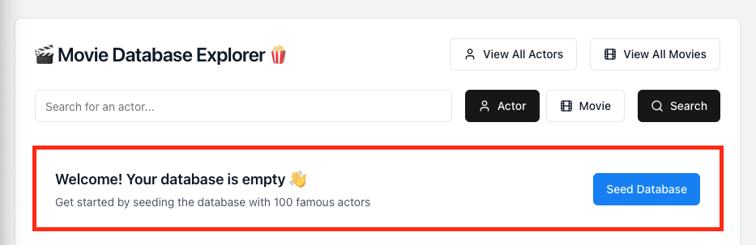
   - Dual-mode search for actors or movies, navigation to view all actors or movies pages
   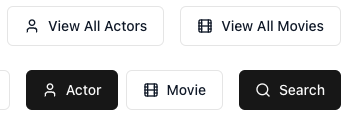
   - Auto-complete suggestions
   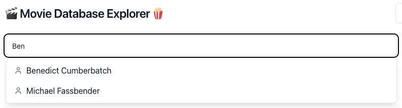
   - Support for adding actor data by fetching from The Movie Database (TMDB) API
   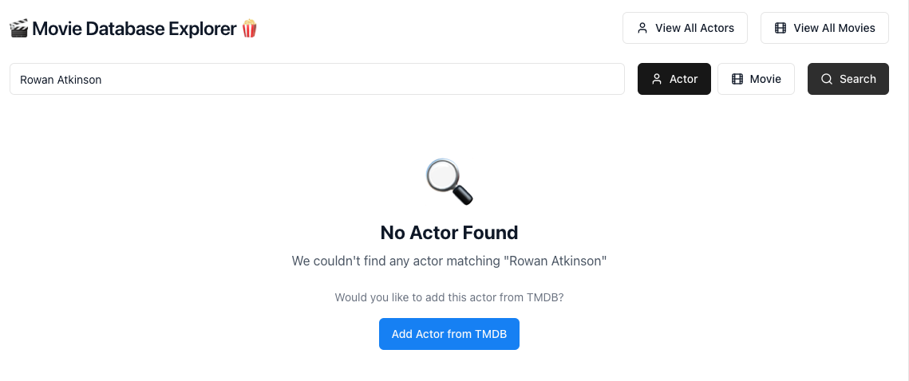
     - After clicking the button, the actor data will be fetched from TMDB and added to the database
   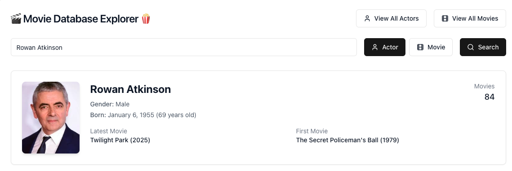

2. **Graph Visualization with Learning Oriented Features**
   - Cypher query visualization with toggle for query display
   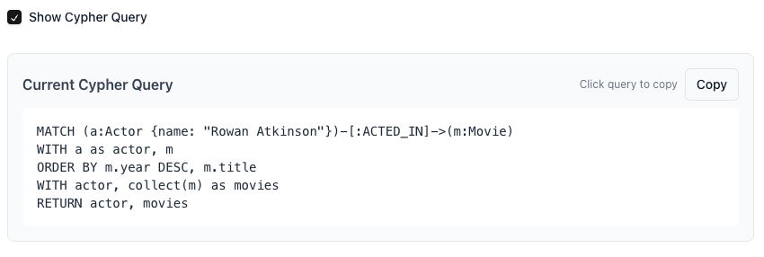
   - Interactive force-directed graph showing relationships
   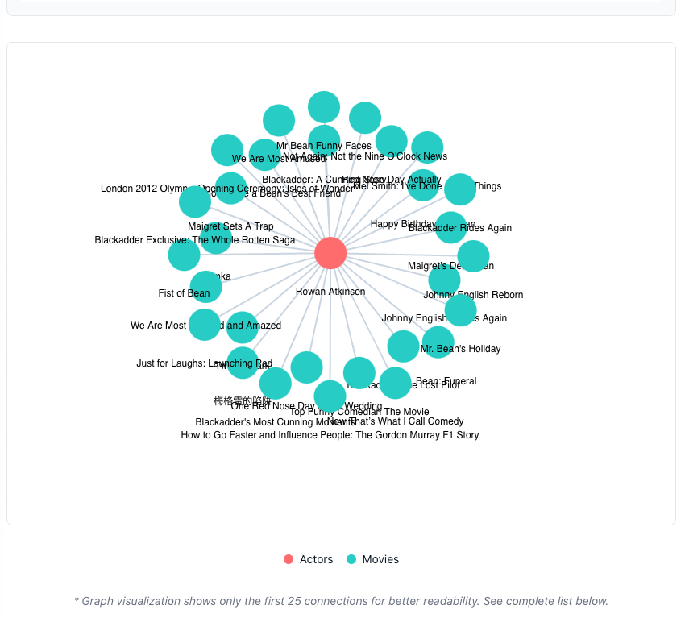
     - Color-coded nodes (red for actors, green for movies)
  
3. **Actor & Movie Information**
   - Actor filmographies with year information
   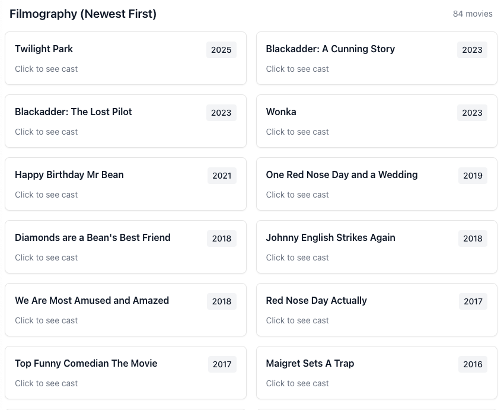
   - Movie cast lists (limited to actors in the database)
   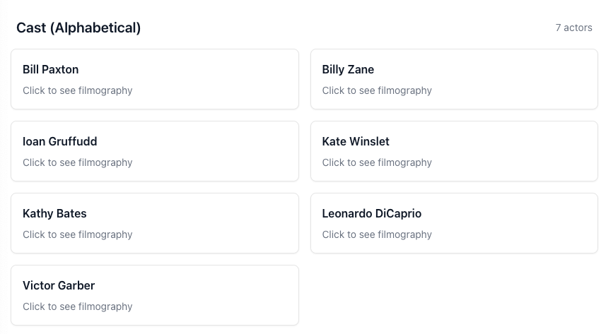
   - Profile images for actors
   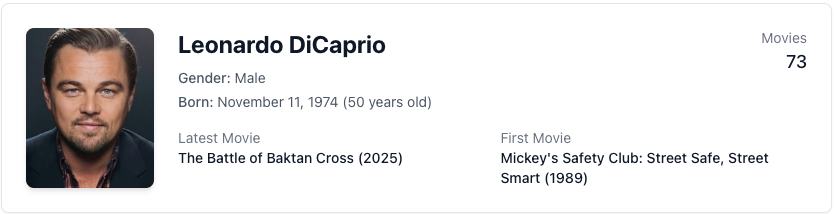
   - Movie posters
   

4. **Navigation**
   - View all actors
   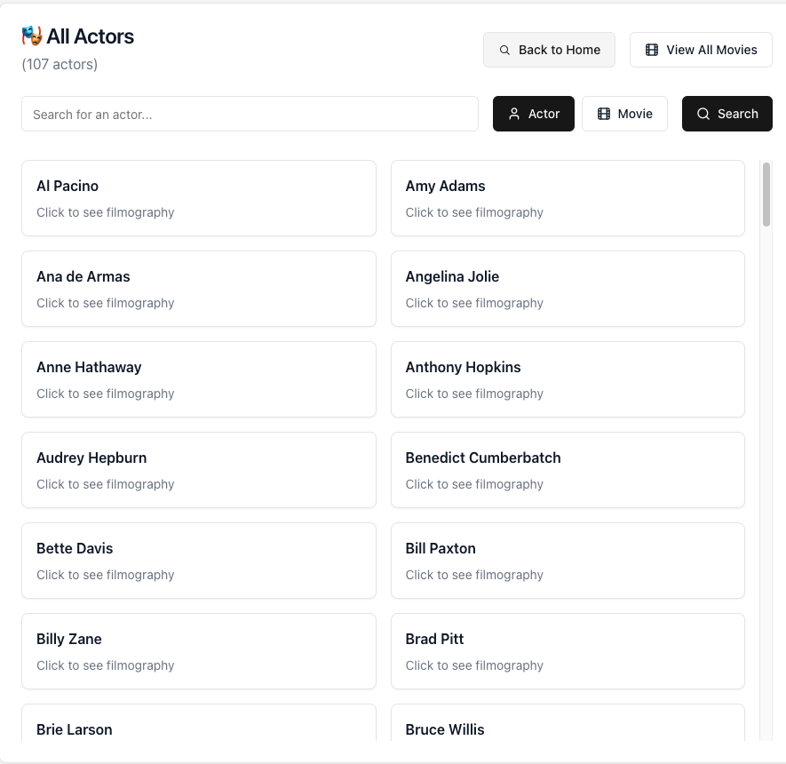
   - View all movies
   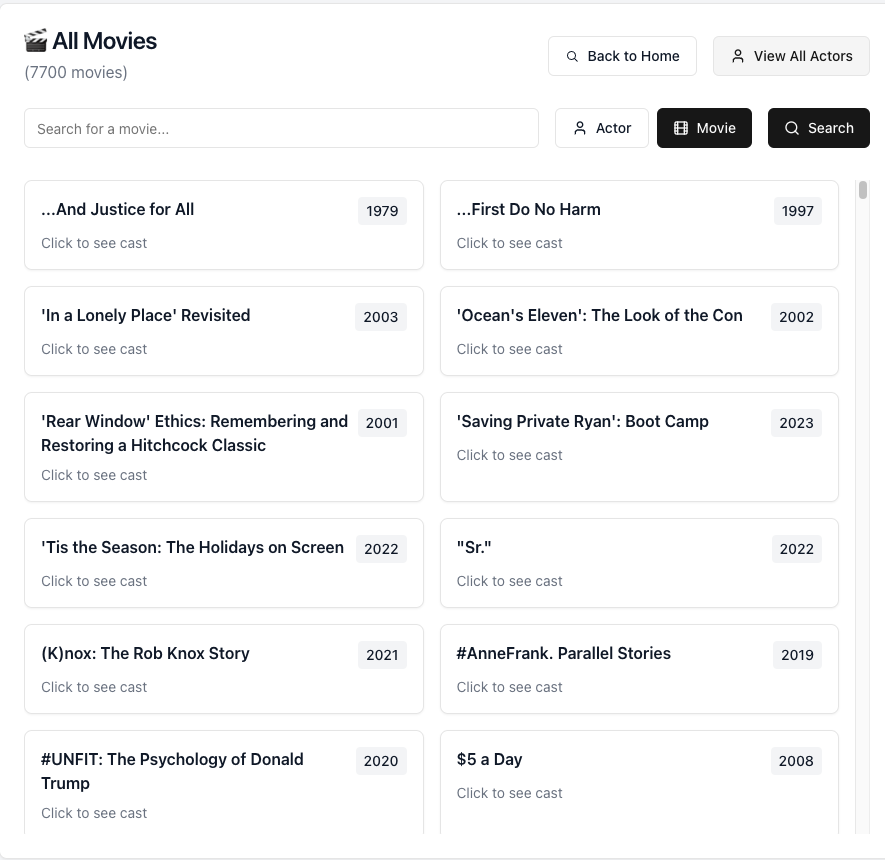
   - Browser history integration
     - Actor search url example: http://localhost:3000/?q=Daniel+Radcliffe&type=actor
     - Movie search url example: http://localhost:3000/?q=Harry+Potter+and+the+Philosopher%27s+Stone&type=movie 
